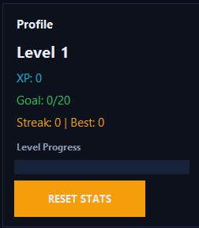
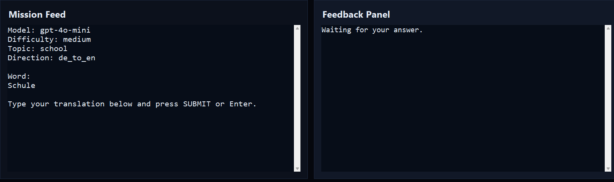
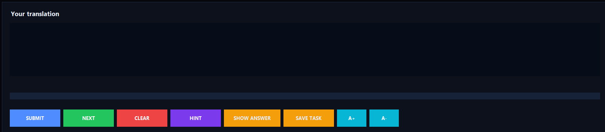

# 🚀 English Trainer

Modern English learning app with multiple training modes, statistics, and AI-powered exercises.

---

## 📸 Preview







---

## ✨ Features

- Multiple training modes:
  - Vocabulary
  - Sentence
  - Translate
  - Multiple Choice
  - Grammar Test
  - Vocab Test
- AI-powered exercises
- Progress tracking (XP, Level, Streak)
- Favorites & mistake training
- Clean modern UI
- One-click setup (automatic Python installation)

---

## ⚙️ Installation (Easy)

1. Download the project from GitHub  
2. Extract the ZIP file  
3. Run:

```bash
oneclick_setup.bat
